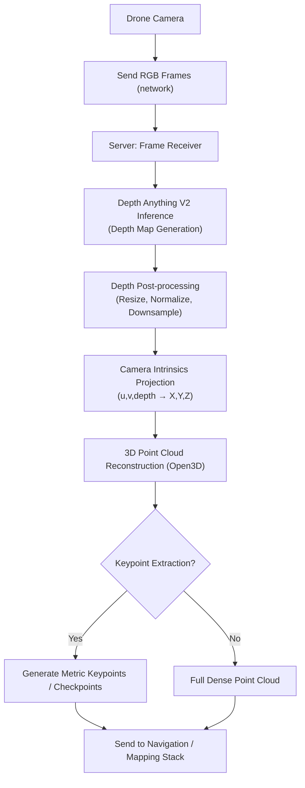

# Untitled

# 📘 Depth Anything V2 Deployment for Drone → Server 3D Perception

## Overview

This deployment pipeline enables a drone equipped with a monocular camera to stream video frames to a ground server. The server runs **Depth Anything V2** to estimate dense depth maps, reconstructs a **3D point cloud** from the inferred depths using known camera intrinsics, and extracts **metric keypoints** for navigation or environment perception.

The system has two main components:

1. **Drone (Client)**
    - Captures RGB frames from onboard camera.
    - Streams frames (e.g., via UDP/TCP/WebSocket/ROS topic) to the server.
2. **Server (Processing Node)**
    - Receives incoming frames.
    - Runs **Depth Anything V2** to compute per-pixel depth.
    - Converts depth + camera intrinsics into **3D coordinates (X,Y,Z)**.
    - Outputs **point cloud** (Open3D) and/or **checkpoint keypoints** for mapping.

---

## Workflow Diagram

---

## Data Flow

1. **Frame Acquisition (Drone)**
    - Drone captures RGB frames (`640x480` typical).
    - Encodes them (e.g., JPEG or raw numpy).
    - Transmits to server (socket, ROS2 pub/sub, or gRPC).
2. **Depth Estimation (Server)**
    - Input: RGB frame.
    - Model: **Depth Anything V2** (`vitb` encoder for balance of speed & accuracy).
    - Output: Dense depth map (`H x W`, float values).
3. **3D Projection**
    - Camera intrinsics applied:X=fx(u−cx)⋅Z,Y=−fy(v−cy)⋅Z,Z=depth(u,v)
        
        X=(u−cx)⋅Zfx,Y=−(v−cy)⋅Zfy,Z=depth(u,v)X = \frac{(u - c_x) \cdot Z}{f_x}, \quad
        Y = -\frac{(v - c_y) \cdot Z}{f_y}, \quad
        Z = \text{depth}(u,v)
        
    - Produces `(N,3)` 3D points.
4. **Point Cloud Construction**
    - Open3D used to maintain a live **point cloud viewer**.
    - Point clouds updated per frame for real-time perception.
5. **Keypoint / Checkpoint Extraction** *(optional)*
    - Instead of dense point clouds, select sparse **keypoints** (e.g., corners, ORB/SIFT features, or geometric sampling).
    - These can be used as **navigation landmarks** for multi-robot or drone autonomy.

---

## Example Deployment Notes

- **Drone → Server Communication**:
    - If using ROS2 → publish `/camera/image_raw` to server node.
    - If using raw networking → use `cv2.imencode` + sockets.
- **Server Resources**:
    - GPU (CUDA or MPS) strongly recommended.
    - CPU fallback possible, but slower.
- **Integration**:
    - Keypoints can be published back to drone as waypoints.
    - Point cloud can be fed into **SLAM / mapping systems**.

---

## Key Benefits

- **Metric Depth from a Single Camera**: No stereo rig required.
- **Scalable**: Multiple drones can send frames to the same server.
- **Flexible**: Output can be full point cloud or sparse keypoints.
- **Integration-ready**: Compatible with ROS2 / Open3D / SLAM stacks.