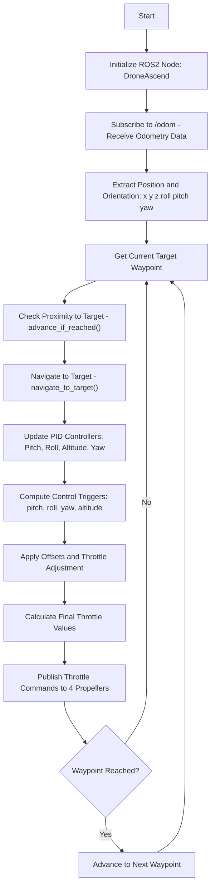

# Documentation: Feedforward-PID Based Waypoint Navigation for BEE Drone(control9.py)

## 1. Overview

This control framework enables a quadrotor drone (BEE project) to autonomously follow a series of 3D waypoints while maintaining stability in roll, pitch, yaw, and altitude. The system combines:

- **Feedforward-PID controllers** for each degree of freedom (DOF).
- **Waypoint navigator** to sequence through target positions and orientations.
- **ROS 2 node (`DroneAscend`)** to handle sensor feedback, control computations, and actuator commands.

The design ensures **smooth transitions**, **braking during overshoot**, and **robust waypoint tracking**.

  

---

## 2. Control Architecture

### 2.1 Feedforward-PID Controller

Each DOF (pitch, roll, yaw, altitude) is controlled using an extended **PID controller** with an added **feedforward braking term**.

Control law:

u=Kpe+Ki∫edt+Kddedt−Kbrake⋅vu = K_p e + K_i \int e dt + K_d \frac{de}{dt} - K_{brake} \cdot v

u=Kpe+Ki∫edt+Kddtde−Kbrake⋅v

Where:

- e=xtarget−xcurrente = x_{target} - x_{current}e=xtarget−xcurrent is the error.
- vvv is the estimated velocity (from position difference).
- KbrakeK_{brake}Kbrake applies a velocity-proportional braking force if the drone is approaching the target, reducing overshoot.

This modification improves **stability near targets** and **prevents oscillations**.

---

### 2.2 Waypoint Navigation

- A predefined sequence of waypoints (x,y,z,yaw)(x,y,z,yaw)(x,y,z,yaw) guides the drone’s mission.
- The **navigator checks proximity** to the current waypoint using a positional and yaw threshold.
- If the drone remains within this threshold for a set hold time, the system advances to the next waypoint.

This ensures **deliberate waypoint confirmation** instead of premature switching.

---

### 2.3 Control Loop

The main node (`DroneAscend`) executes the control loop:

1. **Odometry input** (`/odom`): Provides position and orientation (converted from quaternions to Euler angles).
2. **Navigation**: `navigate_to_target()` computes triggers (roll, pitch, yaw, altitude) using the feedforward-PID controllers.
3. **Throttle calculation**:
    - Base hover throttle (ThoverT_{hover}Thover) is adjusted with altitude correction.
    - Pitch, roll, and yaw triggers add small offsets to distribute thrust among four propellers.
4. **Actuator output**: Corrected throttle commands are published to `/propeller1..4`.

---

## 3. Control Allocation

Throttle for each propeller is adjusted as:

- **Pitch control**: Opposite propellers receive differential thrust.
- **Roll control**: Left-right propellers are modulated.
- **Yaw control**: Counter-torque offsets applied.
- **Altitude control**: Uniform thrust adjustment across all propellers.

This follows the **standard quadrotor control principle**, but extended with **PID + braking compensation**.

---

---

## 4. Advantages of the Technique

- **Smooth motion**: Feedforward braking prevents oscillations when approaching waypoints.
- **Robust waypoint tracking**: Position and yaw thresholds avoid premature switching.
- **Scalable control**: Separate PID controllers for each DOF simplify tuning and debugging.
- **ROS 2 integration**: Modular design with publishers and subscribers for real-time drone control.

---

## 5. Example Mission

In the provided code, the drone:

1. Ascends to 5m altitude.
2. Moves through a square trajectory.
3. Returns to the origin.
4. Descends to 1m altitude for landing.

This demonstrates **multi-waypoint autonomous flight** with stable attitude and altitude control.
